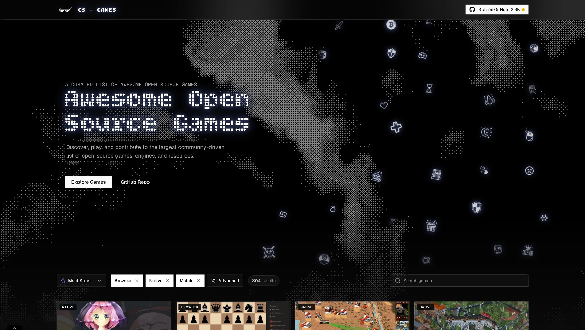
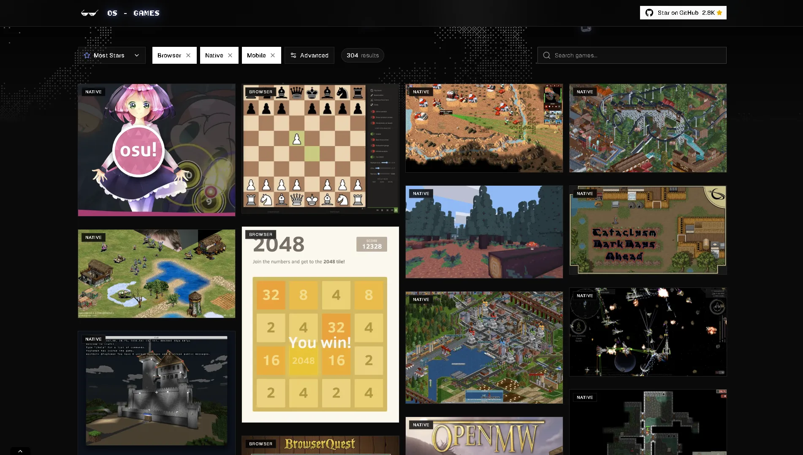

# Awesome Open Source Games — Website

An interactive SPA that transforms the [root `README.md`](../README.md) game list into a searchable, filterable, and visually striking interface.

|                                                      |                                                           |
| ---------------------------------------------------- | --------------------------------------------------------- |
|  |  |

## Branch Layout

| Branch    | Purpose                                                                         |
| --------- | ------------------------------------------------------------------------------- |
| `main`    | Original upstream content — `README.md` game list, contributing guides          |
| `website` | This SPA — all frontend source code lives here                                  |
| `tools`   | Local curation scripts for batch image management (not part of the upstream PR) |

---

## Tech Stack

| Layer      | Choice                              |
| ---------- | ----------------------------------- |
| Framework  | React 19 + Vite 8                   |
| Language   | TypeScript                          |
| Styling    | Tailwind CSS v4                     |
| Search     | `fuse.js` (fuzzy, zero-latency)     |
| Graphics   | Native WebGL2 (Bayer dither shader) |
| Deployment | GitHub Actions → GitHub Pages       |

---

## Data Pipeline

The site is driven by a single source of truth: **`/README.md`** at the repo root.

```
README.md  ──►  parse-readme.js  ──►  src/data/final_games.json
                                            │
                   github-stars.js  ◄───────┘
                         │
                         ▼
               src/data/final_games.json  ──►  Vite build
```

### `scripts/parse-readme.js`

Parses the root `README.md` into structured JSON.

- Iterates markdown `##`/`###` headers to infer **category** and **subcategory**
- Extracts `name`, `description`, `link`, and `tags` for each list item
- Scans `public/games/<id>/` to detect available `.webp` screenshots
- Outputs `src/data/games.json`

```bash
node scripts/parse-readme.js
```

### `scripts/github-stars.js`

Enriches `games.json` with live GitHub metadata (stars, commits proxy, last push, language) and computes a `relevanceScore` for default sorting.

**Key behaviors:**

- **Delta mode (default)**: skips games that already have `stars > 0` — fast re-runs
- **Force mode (`--all`)**: re-fetches every game, bypasses the delta check
- **Cache**: stores raw API responses in `scripts/enrichment-cache.json` with a 19-day TTL to avoid hammering the API on repeated runs
- **Fallback link**: if a game's primary `link` is a non-GitHub URL, the script falls back to the first GitHub URL found in the game's `links[]` array
- **Rate-limit handling**: detects HTTP 403/429 and stops fetching for the current run, preserving existing stats

```bash
# Default — only fetch games with missing stats
node scripts/github-stars.js

# Force refresh everything (ignores cache TTL)
node scripts/github-stars.js --all
```

---

## Getting Started

```bash
# From the repo root, or cd website/ first
cd website/

# Install dependencies
pnpm install

# (Optional) Rebuild game JSON from README
node scripts/parse-readme.js

# (Optional) Enrich with GitHub stats
node scripts/github-stars.js

# Start hot-reload dev server — opens at http://localhost:5173/
pnpm run dev
```

### Other commands (recommended)

| Command            | Description                                          |
| ------------------ | ---------------------------------------------------- |
| `pnpm run build`   | Type-check + production Vite build → `dist/`         |
| `pnpm run preview` | Serve the production build locally for smoke-testing |
| `pnpm run lint`    | Run ESLint across the project                        |
| `pnpm run format`  | Auto-format with Prettier                            |

> On index.html you can uncomment the react-scan in \<head> tag

---

## Key Components

- **`<Dither />`** — WebGL2 fragment shader computing procedural noise (fBm) quantized through an 8×8 Bayer matrix. Produces a retro dithered background with zero JS overhead at runtime.
- **`<GameExplorer />`** — Central state machine for fuzzy search, category/subcategory filters, and sort modes. Consumes `final_games.json` statically at build time.
- **`<GameGrid />`** — Masonry layout using CSS grid columns with row-first DOM ordering (`i % cols`) so that sort order maps correctly to visual rows and browser image-loading prioritizes the visible viewport.
- **`<GameCard />`** — Native `` with `fetchpriority="high"` on above-fold cards and `loading="lazy"` on the rest. Hover triggers a multi-image preview carousel.

---

## Development Guidelines

- **Path aliases**: use `@/components/...` — configured via `vite-tsconfig-paths`
- **Image paths**: screenshots live in `public/games/<game-id>/`. The enrichment script detects them automatically and stores relative paths (e.g. `/games/lichess/lichess.webp`) in `final_games.json`
